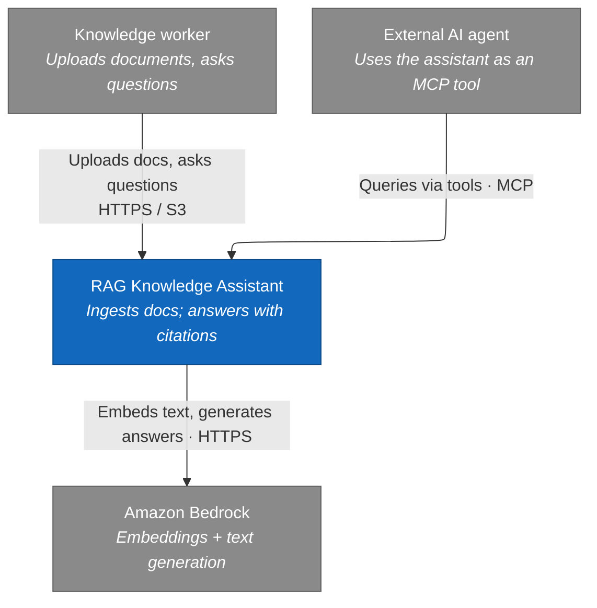
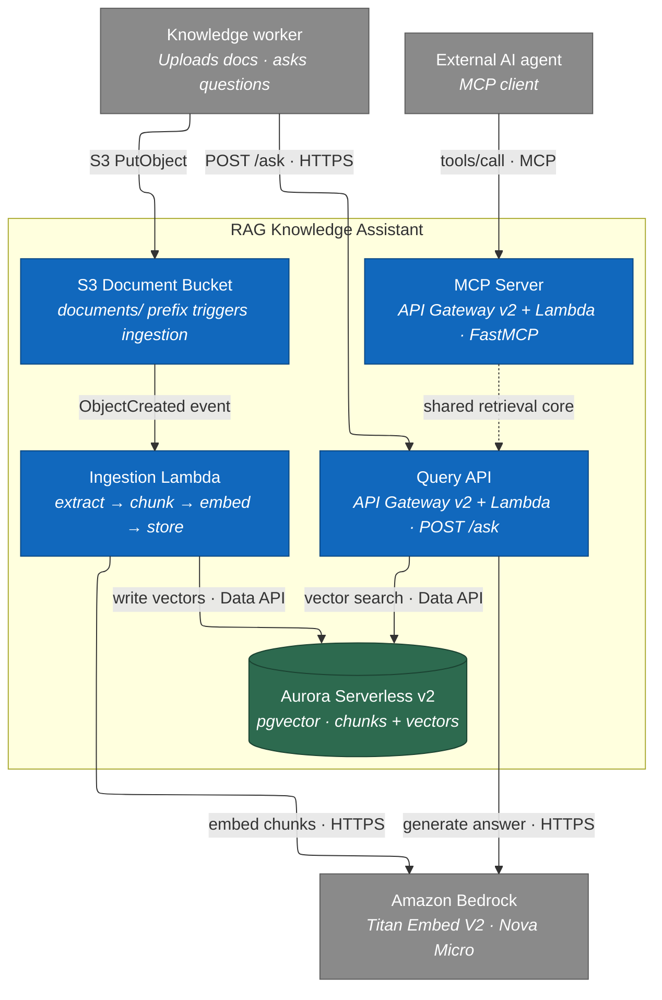

# Architecture — RAG knowledge assistant with MCP

A serverless retrieval-augmented-generation (RAG) system on AWS. Documents are
ingested into a vector store; users (and other AI agents, via MCP) ask questions
and get answers grounded in the documents, with citations. Built as a learning
project targeting AWS SAA-C03 and GitHub GH-600.

Diagrams are Mermaid flowcharts and render on GitHub.

## Two paths

- **Ingestion (write path):** document -> extract text -> chunk -> embed -> store
  vectors + metadata.
- **Query (read path):** question -> embed -> vector search (top-k) -> generate
  an answer from the retrieved context, with citations.

The query path is exposed two ways over the same core logic: a REST API for
humans/apps, and an **MCP server** so any agent can use it as a tool.

## Level 1 — System Context

## Level 2 — Container

| Container | Technology | Notes |
|---|---|---|
| Document Bucket | Amazon S3 | `documents/` prefix triggers ingestion; same loop-prevention discipline as before. |
| Ingestion | Lambda (later Step Functions) | Single Lambda first; refactor to a state machine when retries/observability matter (a future ADR). |
| Vector Store | Aurora Serverless v2 + pgvector | Accessed via the **Data API** (HTTP/IAM) so Lambda needs no VPC. `min_capacity = 0` lets it idle near-free. |
| Query API | API Gateway + Lambda | Embeds the question, runs top-k search, calls Bedrock to answer with citations. |
| MCP Server | Lambda | Exposes `search_documents` and `ask_question` as MCP tools over the same retrieval core. |

## Cross-cutting

- **Secrets Manager** — Aurora credentials (no secrets in code).
- **Cognito** — auth on the API/MCP endpoints (introduced in a later spec).
- **CloudWatch** — logs, metrics, and traces (the GH-600 observability story).
- **VPC** — not required early thanks to the Aurora Data API; an optional later
  spec moves Aurora into private subnets with VPC endpoints (SAA-C03 networking).

## Key decisions (to become ADRs)

- **Vector store: Aurora Serverless v2 + pgvector, via the Data API.**
  OpenSearch Serverless was rejected on cost (a ~$700/month floor). Aurora can
  scale to zero when idle and the Data API removes the need to put Lambda in a
  VPC, while still teaching Aurora, Secrets Manager, and pgvector. **S3 Vectors**
  is the documented cheaper alternative (zero idle cost) if cost outweighs the
  relational/SAA-C03 learning value.
- **Bedrock for embeddings and generation.** Managed models; no model hosting,
  no GPUs, no inference servers to run.
- **One retrieval core, two transports.** The REST API and the MCP server call
  the same query logic, so behaviour can't drift between them.

## LocalStack vs real AWS

The same split as the prior project applies. The ingestion skeleton (S3 +
Lambda + a key/value store) runs on LocalStack for the fast inner loop. Bedrock
and the Aurora Data API are not in LocalStack's free tier, so from the embeddings
spec onward, integration tests that need them run against **real AWS**, gated by
an environment flag — exactly the pattern used for Rekognition previously.
